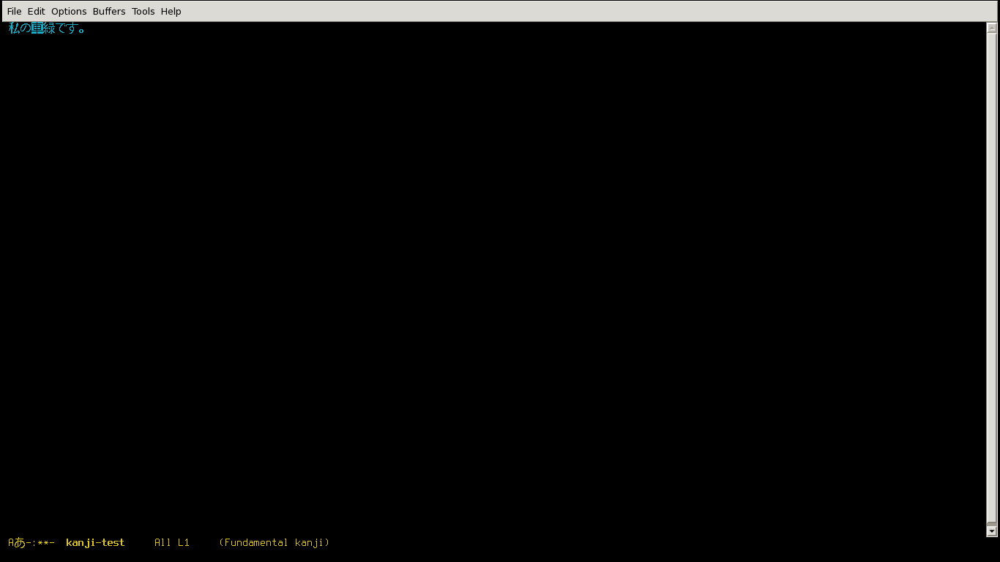

kanji-mode
==========

About
-----
This is a minor mode for GNU Emacs aiming to address a common need of Japanese language learners - getting the stroke order of a particular Kanji sign. It has a built-in collection of SVG images depicting stroke orders for all Kanji. The collection is a slightly modified and limited version of the SVGs provided by the [KanjiVG](http://kanjivg.tagaini.net/) project. The mode's operation is pretty simple. It retrieves the Unicode code of the character under the Emacs cursor and uses it to retrieve the proper SVG file (the files are happily named using Unicode numbers). It then displays the relevant SVG in a transient buffer.

Installation
------------
`Kanji-mode` is available on [MELPA](http://melpa.org/#/) to be installed via `package.el`. If you have `MELPA` configured as package repository, just run <kbd>M-x package-install</kbd> and enter "kanji-mode". You can also select it for installation while browsing the package list after running <kbd>M-x package-list-packages</kbd>.
To install manually `kanji-mode` download this repository somewhere you keep your Emacs modes (I keep it under `~/.emacs.d/`). Then follow these simple steps:
* Make sure the `kanji-mode` directory is part of your Emacs `load-path`. You can do it by adding the following line to your `.emacs` configuration file: `(add-to-list 'load-path "/path/to/your/kanji-mode")`
* Require `kanji-mode` by adding the following to `.emacs`: `(require 'kanji-mode)`. `kanji-mode` adds a hook to `text-mode`, so it should launch automatically whenever you edit a text file. If you need it in other circumstances (temporary buffers, etc.), you can always launch it manually by hitting <kbd>M-x</kbd> and entering "kanji-mode". 
**WARNING** In order to be able to use transcription, you need to install the Kakasi utility. Most Unix-like operating systems already have some convenient way of installing it, otherwise you can find the source [here](http://kakasi.namazu.org/).

Usage
-----
Once `kanji-mode` is active, you should be able to see the string "kanji" in the minor mode list in the buffer mode line at the bottom. Whenever you want to check the stroke order for a character under the cursor, hit <kbd>M-s M-o</kbd> (I tried to make this keybinding intuitively suggest "**s**troke **o**rder") and a new buffer will appear, containing the image of your character with its stroke order. When you're done viewing it, hit <kbd>q</kbd> to close the buffer and return to your text. Below are two screenshots showing an example usage:

The transcription functions operate on currently selected region or, if region is empty, on the current `thing-at-point`. The key bindings for them are: <kbd>M-s M-h</kbd> (for function `kanji-mode-kanji-to-hiragana`) and <kbd>M-s M-r</kbd> (for function `kanji-mode-all-to-romaji`). Both functions' behavior follows the same pattern with respect to the prefix argument:
- No prefix argument: echo the result in the minibuffer
- Prefix argument `-1` (invokable through <kbd>M--</kbd>): place the result in the kill-buffer
- Any other prefix argument: create a new buffer containing the result (which can be closed by pressing <kbd>q</kbd>)

Notes for OpenBSD users
-----------------------

When trying the Kakasi transcription feature under OpenBSD I experienced some non-obvious problems whereby I would get an empty string instead of the transcription. Some investigation led me first to realize that my `LANG` and `LC_ALL` environment were set to `C`, causing non-ASCII characters to be garbled when running system commands. Setting them to some `UTF-8` locale (e.g. `en_US.UTF-8`) should solve this problem. Another thing I've noticed is that the version of Kakasi available in the Ports system - `2.3.4` for OpenBSD 6.0 and current - had some trouble producing proper characters. My suggestion is to manually install the latest version - `2.3.6`. In order for the `./configure` script to succeed you will need to specify some additional paths:
    
    $ wget http://kakasi.namazu.org/stable/kakasi-2.3.6.tar.gz
    $ tar xvzf kakasi-2.3.6.tar.gz
    $ cd kakasi-2.3.6
    $ CPPFLAGS="-I /usr/local/include" CFLAGS="-I /usr/local/include" LDFLAGS="-L /usr/local/lib" ./configure
    $ make
    $ make install

Acknowledgments
----------------
I'd like to thank Ulrich Apel and all contributors of the [KanjiVG](http://kanjivg.tagaini.net/) project for doing the meticulous work I'd never have the patience to do. I've only made small changes to their files (added a white background so it works well with dark Emacs themes and increased the size to make it more legible) and dropped variants (Kaisho, etc.) since they were unusable in my mode. I'd also like to extend my thanks to Hironobu Takahashi, author of the [Kakasi](http://kakasi.namazu.org/) utility, which does an excellent job transcribing between different alphabets.
